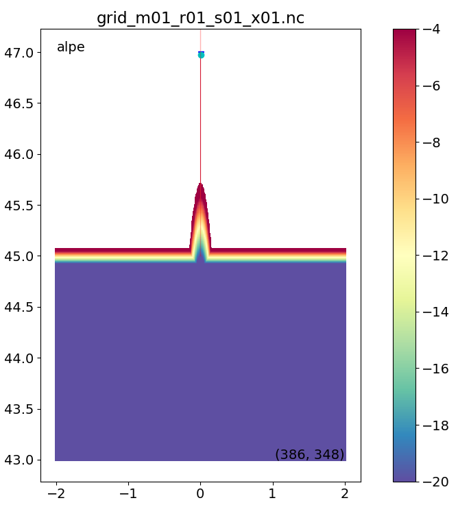
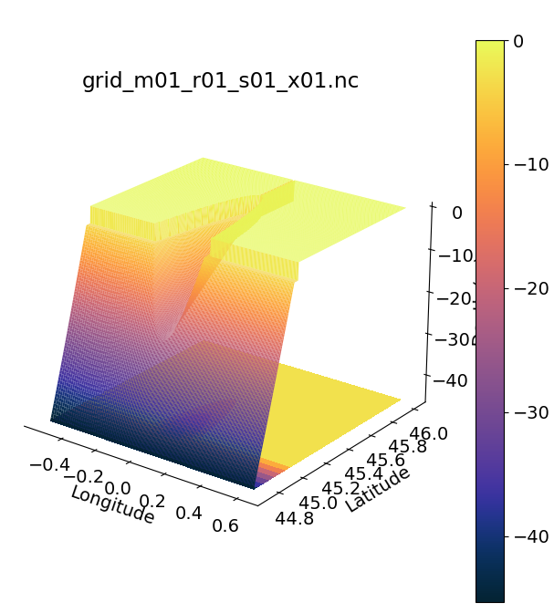

# 06/15/2022 Update

This week I created a new idealized estuary grid and ran the model for 40 days.
The new grid is straight with a parabolic cross section:

I ran the model between 01/01/2020 through 02/10/2020 with the following forcing:

|Forcing | Model Input|
|---|---|
|River Flowrate|1000 cfs|
|Tidal Forcing| Includes spring-neap cycle|
|Ocean Forcing| Estuary half fresh at t=0|
|Atmospheric Forcing|Not implemented in this model|

A salinity cross section plot of the last 10 days is shown below. I noticed that at the end of these 10 days, the estuary becomes more stratified.

